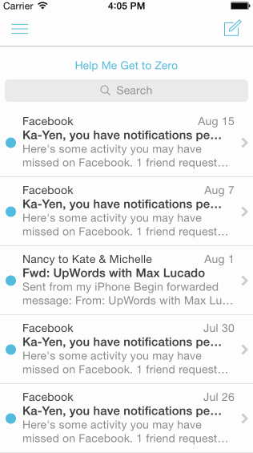

# Mailbox App Demo

The purpose of this homework assignment is to mimic the core use cases of Mailbox in a higher fidelity prototype form and explore animations/gestures.

Time spent: ~9 hours spent in total

Completed user stories:

 * [x] Required: Dragging left, revealed bg color is initially gray
 * [x] Required: As schedule icon is revealed, starts semi transparent and becomes full.  Released, returns to initial position.
 * [x] Required: User swipes such that the later icon starts moving with translation and background changes to yellow. Reveal reschedule options if released.
 * [x] Required: User swipes such that the list icon is swapped and the background color changes to brown.  Reveal list options if released.
 * [x] Required: User is able to dismiss both reschedule and list options. 
 * [x] Required: Dragging right, initial revealed background is gray.
 * [x] Required: Archive icon revealed in transparent and becomes full opague. If released, message returns to initial position
 * [x] Required: Archive icon moves with translation and background changes to green. If user commits to action, reveal green background and hides message.
 * [x] Required; Delete icon is swapped and background changes to read. If user commits to action, reveal red backgruond and hides message.
 * [ ] Optional: User can pan the edge to reveal menu
 * [ ] Optional: User taps on compose
 * [ ] Optional: User taps segmened control in the title should swipe views in from the left or right
 * [ ] Optional: User shakes to undo

Notes:

I completed all of the required cases.

Walkthrough of all user stories:

GIF created with [LiceCap](http://www.cockos.com/licecap/).

